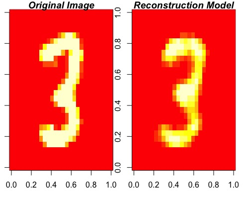

# Restricted Boltzmann Machine 

The original purpose of this project was to create a working implementation of the Restricted Boltzmann Machine (RBM). However, after creating a working RBM function my interest moved to the classification RBM. After creating the classification RBM I got interested in stacking RBM's and Deep Belief Networks (DBN). As the project kept expanding I decided to turn my work into a package. This Readme serves as a description of my package and a small introduction to RBM's, classification RBM's, stacked RBM's and DBN's. 


## Table of contents

  1. [Installation/Data](#installation)
  2. [Restricted Boltzmann Machine](#RBM)
      1. Small Intro
      2. Using `RBM()` 
  3. [Classification Restricted Boltzmann Machine](#ClassRBM)
      1. Small Intro
      2. Using `RBM()` for classification
  4. Stacking Restricted Boltzmann Machines
      1. Small Intro
      2. Using `StackRBM()` 
  5. Deep Belief Model
      1. Small Intro 
      2. Using `DBN()` 

<a name="installation"/>

## Installation


Install the package from GitHub by using the following code in R:

```R
install_github("TimoMatzen/RBM")
```

## Load in the MNIST data

<a name="RBM"/>

## Restricted Boltzmann Machine

### Small Intro
The restricted Boltzmann Machine Iets over CD ook

### Using `RBM()`
After installing the RBM package from Github you can start using the RBM function. I will provide you with a short example of how to use the RBM function. For information about this function and the arguments that it takes you can also just type `?RBM` in your R console.

First start by training your RBM and save it as a model:

```R
modelRBM <- RBM(x = train, n.iter = 1000, n.hidden = 100, size.minibatch = 10)
```

To train a RBM you need to provide the function with train data, which should be a matrix of the shape (samples * features) other parameters have default settings. The number of iterations defines the number of training epochs, at each epoch `RBM()` will sample a new minibatch. When you have enough data it is recommended to set the number of iterations to a high value as this will improve your model; the downside is that the function will also take longer to train. The n.hidden argument defines how many hidden nodes the RBM will have and size.minibatch is the number of training samples that will be used at every epoch.

You can also turn the `plot` argument on to see what the hidden nodes are learning:

```R
# Turn plot on
RBM(x = train, plot = TRUE, n.iter = 1000, n.hidden = 30, size.minibatch = 10)
```
I made a gif of the plots so you can see what it should look like:


After training the RBM model you can check how well it reconstructs the data with the 'ReconstructRBM()' function:

```R
ReconstructRBM(test = test[6, ], model = modelRBM)
```

The function will then output the original image with the reconstructed image next to it. If the model is any good the reconstructed image should look similar or even better than the original:



Congratulations you trained a good generative model on the MNIST data-set! The model reconstruction looks even more like a three than the original image :)

Lets go on and see if we can train a RBM that is not only good at reconstructing data but can actually make predictions on new data with the *classification RBM*.

<a name="ClassRBM"/>

## Classification Restricted Boltzmann Machine

### Small Intro
Link naar het paper van Larochelle

### Using `RBM()` for classification
In the previous part we looked at the RBM as a generative model, now we are going to try and classify labels of the MNIST data-set by training a classification RBM. We can use the `RBM()` function again, the only difference is that we now also provide the labels as the *y* argument:

```R
# This time we add the labels as the y argument
modelClassRBM <- RBM(x = train, y = train_labels, n.iter = 1000, n.hidden = 100, size.minibatch = 10)
```
Now that we have trained our classification RBM we can use it to predict the labels on some unseen test-data with the `PredictRBM()` function:

```R
# Give our ClassRBM model as input
PredictRBM(test = test, labels = test_labels, model = modelClassRBM)
```
Which should output a confusion matrix and the accuracy score on the test set:


Not bad for a first try with the RBM! An accuracy of 85%. We could further improve our classification by performing hyper-parameter tuning on the (1) regularisation, (2) momentum, (3) number of epochs and the size of the minibatches (for more about these terms `?RBM`). However for the minibatch size it is recommended to make this the same size as the number of classes as th RBM function always takes a balanced sample, for the current example this means that the RBM function takes a random sample of each digit (0:9).


### Ergens ook een linkje naar handige filmpjes voor RBM


