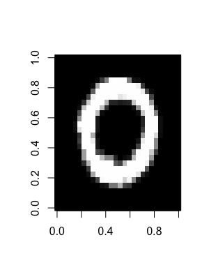
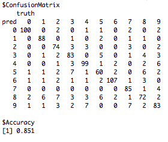
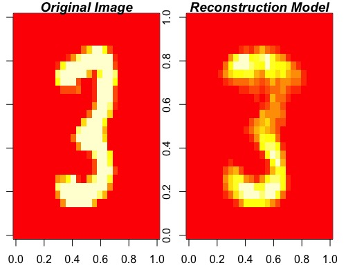
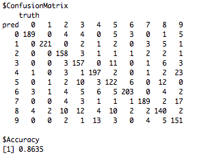

# Restricted Boltzmann Machine 

The original purpose of this project was to create a working implementation of the Restricted Boltzmann Machine (RBM). However, after creating a working RBM function my interest moved to the classification RBM. After creating the classification RBM I got interested in stacking RBMs and Deep Belief Networks (DBN). As the project kept expanding I decided to turn my work into a package. This Readme serves as a description of my package and a small introduction to RBMs, classification RBMs, stacked RBMs and DBNs. 


## Table of contents

  1. [Getting Started](#installation)
      1. Install Package
      2. Data
  2. [Restricted Boltzmann Machine](#RBM)
      1. Small Intro
      2. Using `RBM()` 
  3. [Classification Restricted Boltzmann Machine](#ClassRBM)
      1. Small Intro
      2. Using `RBM()` for classification
  4. [Stacking Restricted Boltzmann Machines](#Stack)
      1. Small Intro
      2. Using `StackRBM()` 
  5. [Deep Belief Network](#DBN)
      1. Small Intro 
      2. Using `DBN()` 
  7.   [Some helpful links](#links)
  6.   [References](#ref)
  

<a name="installation"/>

## Getting Started

### Install Package


Lets start by installing my package from GitHub, this can be done with the following code snippet (installing the package can take a couple of minutes):

```R
# First install devtools
install.packages("devtools")
# Load devtools
library(devtools)
# Install RBM
install_github("TimoMatzen/RBM")
# load RBM
library(RBM)
```

### Data

I have included the MNIST dataset as an example dataset in my package to get you started. The MNIST dataset will be used throughout this document. The MNIST dataset is a hand-written numbers dataset and was downloaded from [Kaggle](https://www.kaggle.com/c/mnist-digits/data). The data is in the format of a list with a train set, train labels, test set and test labels. Lets load in the data:

```R
# Load the MNIST data
data(MNIST)
```

Lets also check for a moment whether the data looks like it is supposed to look:

```R
# Lets plot a data example of the train set
image(matrix(MNIST$train.x[2, ], nrow = 28), col = grey(seq(0, 1, length = 256)))
```

If the data is loaded in correctly it should look something like this:



Oke now we are ready to go on, lets start with the (easiest) model: the Restricted Boltzmann Machine.

<a name="RBM"/>

## Restricted Boltzmann Machine

### Small Intro
Lets start with a small introduction on the Restricted Boltzmann Machine and it's uses. RBMs are undirected graphs ([graphical models](https://en.wikipedia.org/wiki/Graphical_model)) belonging to the family of [Boltzmann machines](https://en.wikipedia.org/wiki/Boltzmann_machine), they are used as *generative* data models (Hinton, 2010). RBMs can be used for data reduction (like PCA) and can also be adjusted for classification purposes (Larochelle et al., 2010). They consist of only two layers of nodes, namely, a *hidden* layer with hidden nodes and a *visible* layer consisting of nodes that represent the data. In most applications the visible layer is represented by binary units, in the examples of this Readme we use the pixel values of the MNIST data which are normalized so they lie between 0 and 1. You can see a graphical representation of the RBM below:

<p align="center">

</p>

Although RBMs belong to the family of Boltzmann Machines; they are not the same as Boltzmann Machines. They are a restricted version of the Boltzmann Machine as the nodes within a layer can only have connections to nodes in a different layer. This seemingly small difference between the Boltzmann Machine and the RBM actually makes for a *huge* difference. Due to the lack of connections between nodes within the hidden and visible layers the RBM is a [complete bipartite graph](https://en.wikipedia.org/wiki/Bipartite_graph). Complete bipartite graphs have a nice property, namely, the nodes within a layer are conditionally independent given the other layer. This makes RBMs a lot easier and efficient to train than the original Boltzmann machine. As the nodes within a layer are conditionally independent of each other given the other layer we can sample all the nodes in the hidden layer given the visible layer at the same time and vice-versa. We can do this by performing Gibbs sampling, we set the visible layer to a random data sample and then sample the hidden layer from the visible layer (*positive phase*) and then reconstruct the visible layer by sampling the visible layer from the hidden layer (*negative phase*). in theory you repeat this process until the samples are coming from the the same distribution as the data (reach equilibrium). However, in the case of RBMs, Hinton (2002) showed that you only need to run Gibbs sampling for a couple of iterations before adjusting the weights and that this also works well and is a lot faster---this method is called *contrastive divergence* (CD). In fact, most RBM learning algorithms get great results by only running one iteration of CD (Hinton, 2010) and that is also what I did in the CD function that I wrote.

The actual function that is being minimized with contrastive divergence is the *energy* of the system. RBMs are energy models and in general a good model has a *low* energy. The energy is a function of the hidden nodes, weights between the hidden and visible layers and the bias terms (similar to the intercept in regression) of the model. Below is the equation for calculating the energy:

<p align="center">

</p>

In this equation *x* stands for the visible nodes, *h* for the hidden nodes, *W* are the weights (parameters) of the model, *b* is the bias of the visible nodes and *c* is the hidden node bias. Do not worry we will not go into more mathematical detail.

Enough of all this theoretical gibberish, lets train our own RBM model!


### Using `RBM()`
After installing the RBM package from Github you can start using the RBM function. I will provide you with a short example of how to use the RBM function. For information about this function and the arguments that it takes you can also just type `?RBM` in your R console.

First start by training your RBM and save it as a model:

```R
# First get the train data from MNIST
train <- MNIST$train.x
# Then fit the model
modelRBM <- RBM(x = train, n.iter = 1000, n.hidden = 100, size.minibatch = 10)
```

To train a RBM you need to provide the function with train data, which should be a matrix of the shape (samples * features) other parameters have default settings. The number of iterations defines the number of training epochs, at each epoch `RBM()` will sample a new minibatch. When you have enough data it is recommended to set the number of iterations to a high value as this will improve your model; the downside is that the function will also take longer to train. The n.hidden argument defines how many hidden nodes the RBM will have and size.minibatch is the number of training samples that will be used at every epoch.

You can also turn the `plot` argument on to see what the hidden nodes are learning:

```R
# Turn plot on
RBM(x = train, plot = TRUE, n.iter = 1000, n.hidden = 30, size.minibatch = 10)
```
I made a gif of the plots so you can see what it should look like:


After training the RBM model you can check how well it reconstructs the data with the `ReconstructRBM()` function:

```R
# Get the test-data from MNIST
test <- MNIST$test.x
# Reconstruct the image with modelRBM
ReconstructRBM(test = test[6, ], model = modelRBM)
```

The function will then output the original image with the reconstructed image next to it. If the model is any good the reconstructed image should look similar or even better than the original:


Congratulations you trained a good generative model on the MNIST data-set! The model reconstruction looks even more like a three than the original image :)

Lets go on and see if we can train a RBM that is not only good at reconstructing data but can actually make predictions on new data with the *classification RBM*.

<a name="ClassRBM"/>

## Classification Restricted Boltzmann Machine

### Small Intro
In the previous chapter we discussed the RBM as a generative model, which was also one of the original purposes. However, in this section we will also look at the RBM as a discriminative model. Larochelle et al. (2012) wrote a nice paper on this topic and their proposed method is very intuitive---at least I found it to be intuitive. Instead of only having one visible layer, which in the MNIST example consists of pixel values, they added a second visible layer---the (binarized) labels. The hidden layer is then a function of both the pixel values and the (binarized) labels. The following image, also from the Larochelle et al. (2012) paper, illustrates this nicely:

<p align="center">

</p>

So the only change that is made with regards to the original RBM is that the model now also has label weights and biases. After training the system, again with contrastive divergence, each possible label can be tried in combination with the data and the model picks the label that has the lowest energy out of all the labels. The energy function now looks as follows:

<p align="center">

</p>

The parts in bold are the parts that are added to the energy function and represent the labels (*y*), label weights (*U*) and label bias (*d*).

I have implemented this method in the `RBM()` function, lets see if it works!


### Using `RBM()` for classification
Lets try and classify labels of the MNIST data-set by training a classification RBM. We can use the `RBM()` function again, the only difference is that we now also provide the labels as the *y* argument:

```R
# First get the train labels of MNIST
TrainY <- MNIST$train.y
# This time we add the labels as the y argument
modelClassRBM <- RBM(x = train, y = TrainY, n.iter = 1000, n.hidden = 100, size.minibatch = 10)
```
Now that we have trained our classification RBM we can use it to predict the labels on some unseen test-data with the `PredictRBM()` function:

```R
# First get the test labels of MNIST
TestY <- MNIST$test.y
# Give our ClassRBM model as input
PredictRBM(test = test, labels = TestY, model = modelClassRBM)
```
Which should output a confusion matrix and the accuracy score on the test set:



Not bad for a first try with the RBM! An accuracy of 85%. We could further improve our classification by performing hyper-parameter tuning on the (1) regularisation, (2) momentum, (3) number of epochs and the size of the minibatches (for more about these terms `?RBM`). However for the minibatch size it is recommended to make this the same size as the number of classes in the data as the RBM function always takes a balanced sample, for the current example this means that the RBM function takes a random sample of each digit (0:9).


<a name="Stack"/>

## Stacking Restricted Boltzmann Machines

### Small intro
So now that we have worked with the regular RBM and the classification RBM we are going to make the model a little bit more complex by *stacking* up RBMs to create a *deep* network structure. It turns out that this can be done quite easily by training each RBM on the output of the last RBM (Hinton, Osindero & Teh, 2006). The procedure is as follows: you start by training a RBM on the original data until convergence and then use the output (hidden nodes) of this RBM as input for training the next RBM. This procedure is repeated until the desired number of layers has been reached, the following image from the [University of Montreal](http://www.iro.umontreal.ca/~lisa/twiki/bin/view.cgi/Public/DeepBeliefNetworks) illustrates this process nicely:

<p align="center">

</p>

In general, stacking RBMs is only used as a greedy pretraining method for training a Deep Belief Network as the top layers of a stacked RBM have no influence on the lower level model weights. However, this model should still learn more complex features than a regular RBM. 

Lets put it to the test!


### Using `StackRBM()`
Now lets try and stack some layers of RBM with the `StackRBM()` function, this function calls the `RBM()` function for training each layer and so the arguments are not much different, except for the added *layers* argument. With the layers argument you can define how many RBMs you want to stack and how many hidden nodes each hidden layer should have. Lets try it out:

```R
# Train a stacked RBM with three levels
modStack <- StackRBM(x = train, layers = c(100, 100, 100), n.iter = 1000, size.minibatch = 10)

```


Now that we have trained our stacked RBM with three layers (each of size 100), we can see how well it reconstructs data, again with the `ReconstructRBM()` function. Only this time we should also define the number of layers that were used to train the model:

```R
# Add the layers argument when you have multiple layers of RBM
ReconstructRBM(test = test[6, ], model = modStack, layers = 3)
```
The reconstruction looks quite reasonable:



We can also use the StackRBM function for a supervised model, `StackRBM()` does this by making the last RBM layer a classification RBM as we discussed earlier. Lets fit a supervised stacked RBM:

```R
# Add the labels as the y argument
modStackSup <- StackRBM(x = train,y = TrainY, layers = c(100, 100, 100), n.iter = 1000, size.minibatch = 10)
```
Lets again use the `PredictRBM()` function to see how well our stacked RBM predicts on test data, again we need to provide the layers argument:

```R
# Add layers = 3 
PredictRBM(test = test, labels = TestY, model = modStackSup, layers = 3)
```
The output:



Stacking RBMs improves our classification performance with 1% as compared to the normal RBM. However, stacking RBMs is not a very elegant method though as each RBM layer is trained on the output of the last layer and all the other RBM weights are frozen. It is a greedy method that will not give us the most optimal results for classification. That is why it is normally only used as a greedy pretrain algorithm to get good starting parameters. In the next part we will fit a Deep Belief Network, which finetunes a stacked RBM model with backpropogation using the labels as the criterion. 


<a name="DBN"/>

## Deep Belief Network

### Small Intro
So lets move on to a more elegant method, namely, the Deep Belief Network (DBN). This model was originally developed by Hinton et al. (1995) and was originally trained with the *sleep-wake algorithm*, without pretraining. However, in 2006 Hinton et al. found a method that is more efficient at training DBNs by first training a stacked RBM and then use these parameters as good starting parameters for training the DBN. The DBN then adds a layer of labels at the end of the model and uses either backpropogation or the wake sleep algorithm to finetune the system with the labels as the criterion---the 'DBN()' function in the RBM package uses the backpropagation algorithm. The backpropagation algorithm works as follows: (1) first a feed-forward pass is made trough all the hidden layers ending at the output layer (2) then the output is compared to the actual label and (3) the error is used to adjust the weights in all the layers by going back (backpropogate) through the entire system. This process is repeated until some stopping criterion is reached, in the `DBN()` function that is the maximum number of epochs but it could als be the prediction error on a validation set. The following image from the Hinton et al. (2006) paper shows this nicely: 

<p align="center">

</p>

There is also a really helpful and short [scholarpedia](http://scholarpedia.org/article/Deep_belief_networks) on DBNs written by Geoffrey Hinton himself.

Without  further ado, lets built our own DBN model with the `DBN()` function!

### Using `DBN()`

Now lets try to fit a Deep Belief Network with the `DBN()` function. This will take a bit longer but should normally not take more than a couple of minutes:

```R
# Fit the DBN model
modDBN <- DBN(x = train, y = TrainY, n.iter.pre = 300, n.iter = 1000, nodes = c(500, 300, 150), size.minibatch = 10)
```
As can be seen above running the DBN model takes some more parameters and I would highly recommend first looking at the help page (`?DBN`) to see what each argument does. Not only do you need to define the arguments for fitting the DBN but you also need to define the arguments for pretraining that are passed on to `StackRBM()`. First the function trains a stack of unsupervised RBM to get the weights in the right ball park. After that `DBN()` adds a layer of weights at the end of the model and finetunes the entire system with backpropagation and batch gradient descent. Because the `DBN()` adds a layer of weights the end model is always the number of layers that were defined in the nodes argument + 1, so in this example we end up with a 4 layer DBN. 

We can now check how well our model classifies on unseen data. To do this we run the `PredictDBN()` function remember when inputting the number of layers that the DBN now has a label layer on top:

```R
# Predicting DBN, layers is length(nodes)+1(label layer).
PredictDBN(test = test, labels = TestY, model = modDBN, layers = 4)
```
The output:


Alright we improved our classification performance with almost 2% compared to the stacked RBM! Hopefully this readme document helped with getting an understanding of what the package does and how it can be used, you can always just check the help files of the functions in the package if you forgot something or want to know all the possibilities. Feel free to play around with the parameters of the model and see whether you can improve the classification performance in this readme! 


<a name="links"/>

# Some Helpful Links
If you read this entire document and feel that you are still interested in RBMs and DBNs, here are some links that I found very helpful :)

A good blog on RBMs by Edward Chen:
[RBM Chen](http://blog.echen.me/2011/07/18/introduction-to-restricted-boltzmann-machines/)

A helpful video on RBMs and DBNs by Geoffrey Hinton:
[RBM Hinton](https://www.youtube.com/watch?v=mSh0Wu9dNsA);
[DBN Hinton](https://www.youtube.com/watch?v=tM2QtkiXKxE)

Or the video by Hugo Larochelle on the RBM and contrastive divergence:
[RBM and CD](https://www.youtube.com/watch?v=MD8qXWucJBY)

<a name="ref"/>

# References

1. Hinton, G. E. (2002). Training products of experts by minimizing contrastive divergence. Neural computation, 14(8), 1771-1800. 

2. Hinton, G. E., Osindero, S., & Teh, Y. W. (2006). A fast learning algorithm for deep belief nets. Neural computation, 18(7), 1527-1554.

3. Hinton, G. E. (2010). A practical guide to training restricted Boltzmann machines. In Neural networks: Tricks of the trade (pp. 599-619). Springer, Berlin, Heidelberg.

4. Hinton, G. E., Dayan, P., Frey, B. J., & Neal, R. M. (1995). The" wake-sleep" algorithm for unsupervised neural networks. Science, 268(5214), 1158-1161.

5. Larochelle, H., Mandel, M., Pascanu, R., & Bengio, Y. (2012). Learning algorithms for the classification restricted boltzmann machine. Journal of Machine Learning Research, 13(Mar), 643-669.


